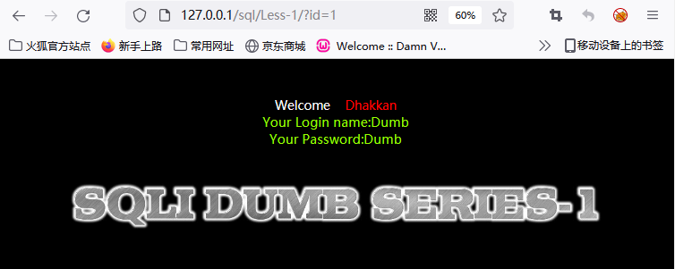
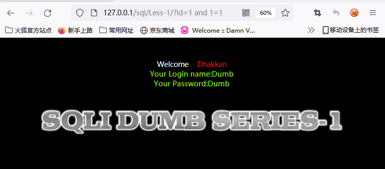
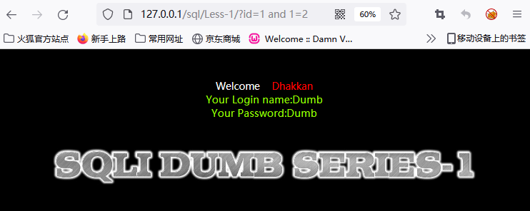
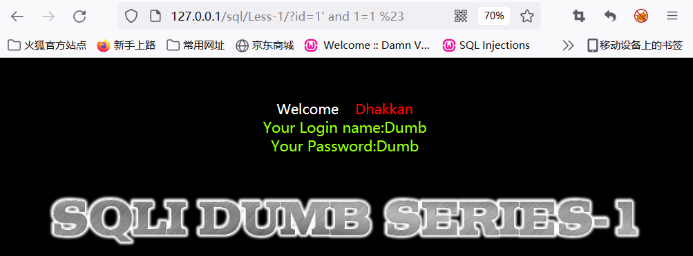
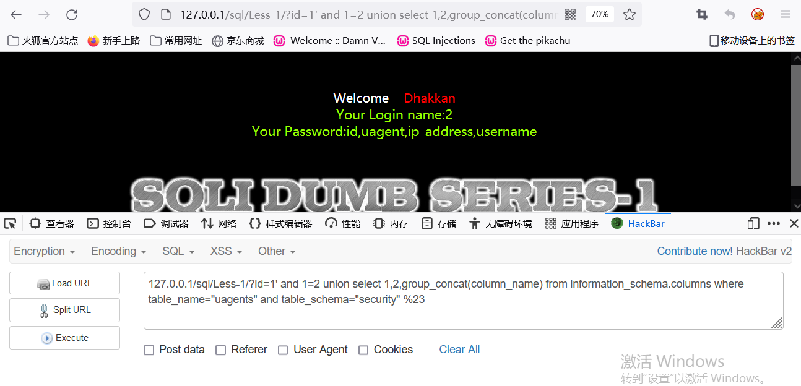
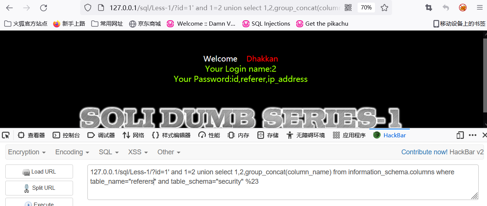
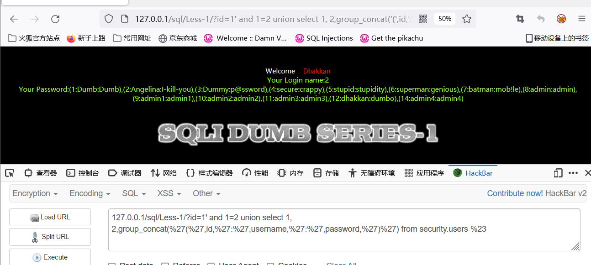
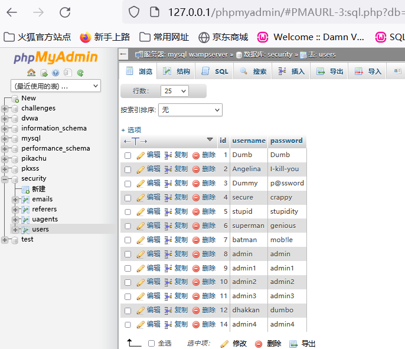

# sql/Less-1  字符型注入（注入点在id=''）

**靶场1：**

**思路：**

通过加上and 1=1 和 and 1=2 尝试寻找注入点

url 后面加上and 1=1 成功访问

url 后面加 and 1=2， 结果还是访问成功？？？

是否是因为没加注释（%23）

加上后还是可以成功访问

在id=1后加上 ‘ 进行尝试，出现关于sql语句的报错

尝试猜测原本代码中的sql语句，‘select ...... from ...... where id=’ ‘ LIMIT 0,1’

猜想该报错是因为在id=1后输入'  后会造成多一个’ （id=' 1' '）的情况，从而产生的报错。

尝试在url尾部加上 %23（%23为#号的转义），注释掉后面的sql语句，从而将后面的 ' 都注释掉。

成功，在and 1=1 时 成功访问 在 and 1=2 时访问失败

说明存在注入点

用order by 判断该表存在几个字段，

**order by:**

在SQL语言中，order by语句后面加上字段名，就可以对查询结果排序。但他有一种特殊用法，就是在后面不添加字段名，而添加数字的方式。添加数字的时候，表示以该表第几个字段进行排序。只有当数字小等于字段数时，才有效。所以通过这个条件，可以判断一个表中存在多少个字段。

在 order by 4时存在sql报错，在order by 3时没有报错，可以判断该表存在3个字段

尝试输出当前数据库名和用户名

通过输出可以看到，数据库名：security 用户名：root@localhost

下一步通过select table_name from information_schema.tables where table_name="security"查看数据库中存在哪些表，利用group_concat()进行拼接输出

通过查看可知security数据库中存在emails,referers,uagents,users四个table

接下来针对各table查询column，

通过回显可知

users表含有3列，分别是id,username,password

uagents表含有4列，分别是id,uagent,ip_address,username

referers表含有3列，分别是id,referer,ip_address

emails表含有2列，分别是id,email_id

接着分别查看各表各字段中的数据

users表 输出格式: (id:username,password）

输出结果： (1:Dumb:Dumb),(2:Angelina:I-kill-you),(3:Dummy:p@ssword),(4:secure:crappy),(5:stupid:stupidity),(6:superman:genious),(7:batman:mob!le),(8:admin:admin),(9:admin1:admin1),(10:admin2:admin2),(11:admin3:admin3),(12:dhakkan:dumbo),(14:admin4:admin4) 

正确获取users表中的数据

sql/Less-1 注入成功
